# A2 — LogiEdge System Architecture

## Architecture Flow

```mermaid
flowchart LR
    subgraph TRUCK["TRUCK / EDGE DOMAIN"]
        direction LR

        subgraph SENSORS["Sensor Layer"]
            direction TB
            TEMP["Temperature Sensor<br/>1 Hz"]
            VIB["Vibration Sensor<br/>0.5 Hz RMS"]
            DOOR["Door Sensor<br/>OPEN / CLOSE events"]
        end

        MQTT["Local Mosquitto Broker<br/>Truck-scoped MQTT topics<br/>QoS 1"]

        subgraph PIPELINE["Local Inference Pipeline"]
            direction LR
            FILTER["Independent Filtering<br/>5-sample moving averages"]
            WINDOW["Windowing and Feature Extraction<br/>30 s window · 10 s step<br/>6-value fused vector"]
            NORM["Fixed Normalisation<br/>Load training_stats.npy<br/>Never recompute live"]
            MODEL["TFLite Inference<br/>MODEL_PATH selected model<br/>Normal · Warning · Critical"]
        end

        ALERT["Local Alert Log<br/>Immediate offline alert<br/>Critical event record"]
        PSI["PSI Drift Monitor<br/>Rolling 100 inferences<br/>Alert above 0.25 · recovery below 0.10"]
        QUEUE["Store-and-Forward Queue<br/>Predictions, alerts and health summaries<br/>retained during signal loss"]
    end

    CELLULAR["Cellular M2M Uplink<br/>Used only when coverage is available"]

    subgraph OPS["OPERATIONS CENTRE"]
        direction LR
        API["Secure API Gateway<br/>Authenticated encrypted uplink"]
        FLEET["Fleet Monitoring<br/>Alerts · health · PSI"]
        DASH["Operations Dashboard<br/>Fleet review and audit"]
        REGISTRY["Model Registry / OTA<br/>Signed model versions<br/>10-truck canary rollout"]
    end

    TEMP --> MQTT
    VIB --> MQTT
    DOOR --> MQTT

    MQTT --> FILTER
    FILTER --> WINDOW
    WINDOW --> NORM
    NORM --> MODEL

    MODEL -->|"Publish inference topic"| MQTT
    MODEL --> ALERT
    MODEL --> PSI

    ALERT --> QUEUE
    PSI --> QUEUE
    MQTT -->|"Operational summaries"| QUEUE

    QUEUE -. "Synchronise when coverage returns" .-> CELLULAR
    CELLULAR -.-> API
    API --> FLEET
    FLEET --> DASH

    REGISTRY -. "Signed OTA model update" .-> CELLULAR
    CELLULAR -. "Validated update to truck" .-> MODEL

    classDef sensor fill:#EAF0FF,stroke:#2F6BFF,color:#17324D,stroke-width:1.5px;
    classDef broker fill:#FFF3E0,stroke:#D97706,color:#17324D,stroke-width:1.5px;
    classDef process fill:#E8F5EE,stroke:#198754,color:#17324D,stroke-width:1.5px;
    classDef alert fill:#FDECEC,stroke:#C73E3E,color:#17324D,stroke-width:1.5px;
    classDef store fill:#EEF1F5,stroke:#5B6573,color:#17324D,stroke-width:1.5px;
    classDef link fill:#EAF0FF,stroke:#2F6BFF,color:#17324D,stroke-width:1.5px;
    classDef backend fill:#F4F7FF,stroke:#2F6BFF,color:#17324D,stroke-width:1.5px;

    class TEMP,VIB,DOOR sensor;
    class MQTT broker;
    class FILTER,WINDOW,NORM,MODEL,PSI process;
    class ALERT alert;
    class QUEUE store;
    class CELLULAR link;
    class API,FLEET,DASH,REGISTRY backend;
```

## Flow Description

1. The temperature, vibration, and door sensors publish truck-scoped messages to the local Mosquitto broker.
2. The local inference pipeline applies independent five-sample filtering, creates 30-second windows at a ten-second step, extracts the six-value feature vector, and normalises it with the fixed values in `training_stats.npy`.
3. The TFLite model selected through `MODEL_PATH` classifies each window as Normal, Warning, or Critical and publishes the result to `logibridge/trucks/{truck_id}/inference`.
4. Critical results are written immediately to the local alert log. Model output confidence is also sent to the rolling PSI monitor.
5. Alerts, predictions, and health summaries are stored in the local store-and-forward queue during the documented 35–90-minute cellular outages.
6. When coverage returns, authorised summaries are sent through the M2M cellular uplink and secure API gateway to fleet monitoring and the operations dashboard.
7. Signed model versions return through the OTA path using the selected ten-truck canary strategy. An offline truck continues using its previous validated model until the update is received and verified.

## Offline Safety Behaviour

The safety-critical path from sensor acquisition through MQTT, preprocessing, inference, PSI monitoring, and local alert logging remains entirely inside the truck. Cellular connectivity is used only for delayed synchronisation and controlled OTA delivery, so a rural network outage cannot stop local fault detection.
